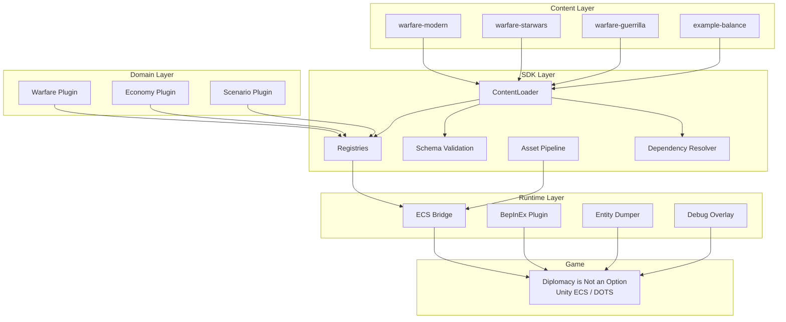
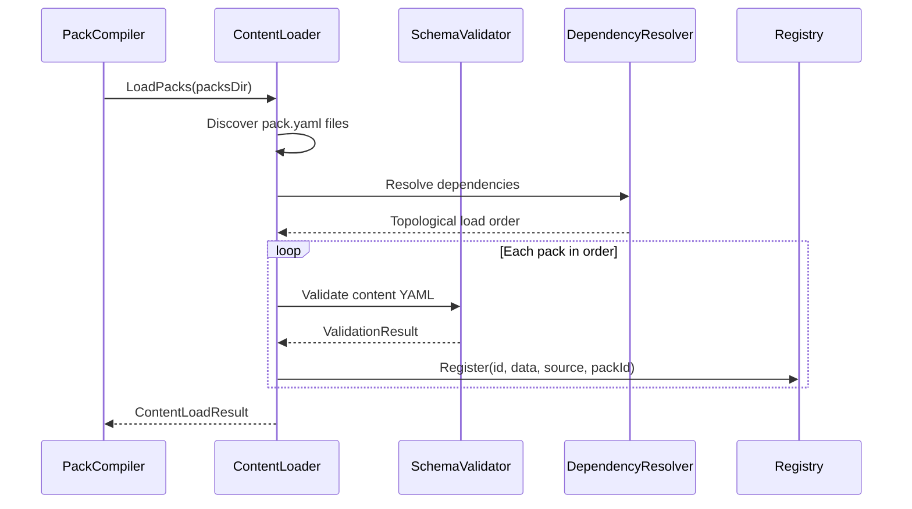

# DINOForge

**General-purpose mod platform for [Diplomacy is Not an Option](https://store.steampowered.com/app/1272320/Diplomacy_is_Not_an_Option/).**

DINOForge is a mod operating system, not a single mod. It provides the framework, registries, schemas, and tooling for building any type of mod — from simple balance tweaks to full total conversion packs.

## Features

### Framework
- **Pack System** — YAML-first declarative content packs with dependency resolution, conflict detection, and schema validation
- **Typed Registries** — Units, buildings, factions, weapons, projectiles, doctrines, skills, waves, squads with layered override priority
- **ECS Bridge** — Maps mod content to DINO's actual Unity ECS components at runtime (30+ component mappings)
- **Asset Pipeline** — AssetsTools.NET integration for reading/writing Unity asset bundles and Addressables catalogs
- **Schema Validation** — 10 JSON schemas catch errors before runtime
- **Hot Module Reload (HMR)** — Live reload packs in-game via FileSystemWatcher (press F10 for Mod Menu)

### Game Content (M5 Complete)
- **Three Example Packs Released**:
  - **warfare-starwars** (26 units × 2 factions, 19 weapons, 10 waves) — Clone Wars era Republic vs CIS
  - **warfare-modern** (26 units × 2 factions, 16 weapons, 10 waves) — NATO vs fictional adversary
  - **warfare-guerrilla** (13 units, 13 weapons, 10 waves) — Asymmetric insurgency scenarios

- **Complete Asset System** (Star Wars Pack):
  - 50 faction-specific textures (26 unit + 20 building textures, 512×512 PNG, sRGB)
  - 4 fully-assembled Blender FBX models (rep_house_clone_quarters, cis_house_droid_pod, rep_farm_hydroponic, cis_farm_fuel_harvester)
  - 24 buildings mapped to Kenney.nl sources with faction color schemes (poly budgets, assembly guides)
  - Procedural texture generation pipeline (HSV-based, 16-worker parallel, < 20 seconds total)

### Domain Plugins
- **Warfare** — Faction archetypes (Order, Industrial Swarm, Asymmetric), doctrines, unit role validation, wave composition, balance calculation
- **Economy** — Resource production, trade routes, faction profiles, balance analysis
- **Scenario** — Campaign definition, victory/defeat conditions, scripted events, difficulty scaling
- **UI** — Mod menu, in-game settings panel, debug overlay with entity inspector

### Developer Tools
- **PackCompiler** CLI: `validate`, `build`, `assets list/inspect/validate` commands
- **DumpTools** CLI: `list`, `analyze`, `components`, `systems` for offline DINO data analysis
- **DebugOverlay** — F9 IMGUI for live ECS world inspection
- **ModMenuOverlay** — F10 IMGUI for pack management and settings

## Quick Start

### Prerequisites

- [.NET 8.0 SDK](https://dotnet.microsoft.com/download/dotnet/8.0) (development only)
- [Diplomacy is Not an Option](https://store.steampowered.com/app/1272320/) (game, required for modding)
- [BepInEx 5.4.x](https://github.com/BepInEx/BepInEx/releases) (installed in game directory)

### Build

```bash
dotnet build src/DINOForge.sln
```

### Test

```bash
dotnet test src/DINOForge.sln
```

### Validate a Pack

```bash
dotnet run --project src/Tools/PackCompiler -- validate packs/example-balance
```

### Install a Mod Pack

1. **Locate DINO directory**: Default Steam location is `C:\Program Files (x86)\Steam\steamapps\common\Diplomacy is Not an Option\`

2. **Ensure BepInEx is installed**:
   ```bash
   # Download BepInEx 5.4.x from https://github.com/BepInEx/BepInEx/releases
   # Extract to game root directory (BepInEx folder + winhttp.dll should be at root)
   ```

3. **Copy mod pack to DINOForge packs directory**:
   ```bash
   # Copy the entire pack folder to:
   # {GAME_ROOT}/BepInEx/plugins/DINOForge/packs/

   # Example: install warfare-starwars pack
   cp -r packs/warfare-starwars/ "{GAME_ROOT}/BepInEx/plugins/DINOForge/packs/"
   ```

4. **Launch game** — DINOForge Runtime will auto-load installed packs in dependency order

5. **Toggle packs in-game**: Press F10 to open the Mod Menu overlay, enable/disable packs and reload

### Create a Custom Mod Pack

Create a directory with a `pack.yaml` manifest:

```yaml
id: my-balance-mod
name: My Balance Mod
version: 0.1.0
author: YourName
type: balance
framework_version: ">=0.1.0"
loads:
  units:
    - units/
  buildings:
    - buildings/
```

Then add YAML content files in the referenced directories. See `packs/example-balance/` or `packs/warfare-starwars/` for complete examples.

## Architecture



### Pack Loading Pipeline



### Registry Priority Layers

```
┌─────────────────────────────────┐
│  Pack (priority 3000+)          │  ← Mod content overrides
├─────────────────────────────────┤
│  Domain Plugin (priority 2000+) │  ← Warfare/Economy defaults
├─────────────────────────────────┤
│  Framework (priority 1000+)     │  ← DINOForge defaults
├─────────────────────────────────┤
│  Base Game (priority 0+)        │  ← Vanilla DINO values
└─────────────────────────────────┘
  Higher priority wins. Same priority = conflict detected.
```

| Layer | Purpose | Target |
|-------|---------|--------|
| **Runtime** | BepInEx bootstrap, ECS system injection, component mapping | netstandard2.0 |
| **SDK** | Public mod API — registries, schemas, pack loading, asset tools | netstandard2.0 |
| **Domains** | Game logic — factions, doctrines, combat, economy | netstandard2.0 |
| **Tools** | CLI — pack compiler, dump analyzer, asset inspector | net8.0 |
| **Tests** | xUnit + FluentAssertions | net8.0 |

## Project Structure

```
DINOForge/
  src/
    Runtime/           # BepInEx plugin + ECS Bridge
    SDK/               # Public mod API
    Domains/Warfare/   # Warfare domain plugin
    Tools/PackCompiler/# CLI: validate, build, assets
    Tools/DumpTools/   # CLI: dump analysis
    Tests/             # Unit + integration tests
  packs/               # Content packs
  schemas/             # JSON Schema definitions
  docs/                # Documentation (VitePress)
```

## Documentation

Visit [kooshapari.github.io/Dino](https://kooshapari.github.io/Dino) for full documentation.

## Development Methodology

- **SDD** (Spec-Driven Development) — specifications drive the pipeline
- **BDD** (Behavior-Driven Development) — acceptance criteria before implementation
- **TDD** (Test-Driven Development) — unit tests for all public APIs
- **DDD** (Domain-Driven Design) — bounded contexts (Warfare, Economy, Scenario)
- **ADD** (Agent-Driven Development) — fully agent-authored codebase
- **CDD** (Contract-Driven Development) — schemas as contracts between packs and engine

## Contributing

See [CONTRIBUTING.md](CONTRIBUTING.md) for guidelines.

## License

MIT

## Acknowledgements

- [BepInEx](https://github.com/BepInEx/BepInEx) — Unity mod loader
- [AssetsTools.NET](https://github.com/nesrak1/AssetsTools.NET) — Unity asset bundle library
- [devopsdinosaur/dno-mods](https://github.com/devopsdinosaur/dno-mods) — Pioneering DINO modding patterns
