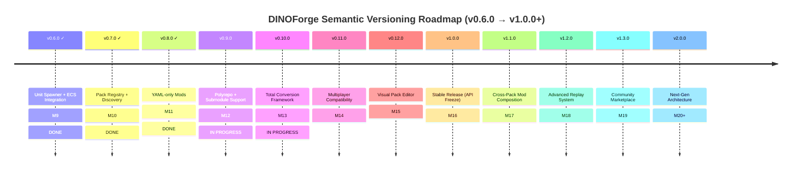
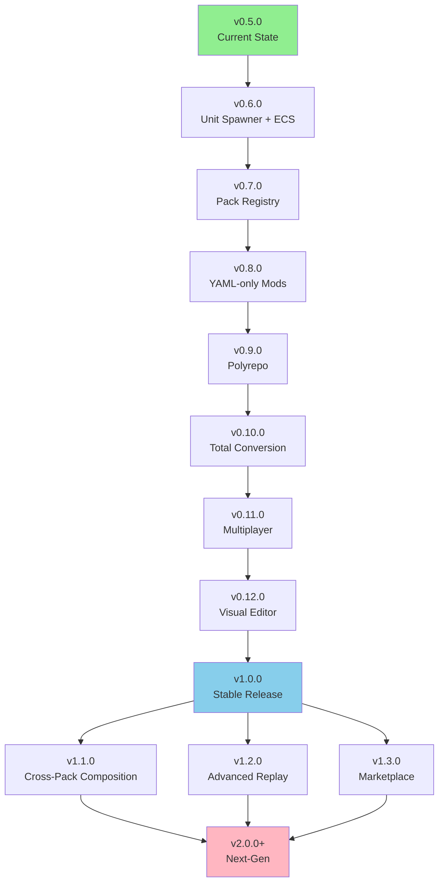

# DINOForge Roadmap (M9-M20+)

## Overview

This roadmap defines the evolution of DINOForge from **v0.6.0 through v1.0.0+** using semantic versioning. Each version represents a major capability milestone, with specific work packages (modules) and success criteria.

**Current Status**: v0.5.0 (Unit Spawner, Pack Registry, YAML-only Mods, Full CI/QA)

**Next Major Phase**: v0.9.0 (Polyrepo Support) and v0.10.0 (Total Conversion Framework)

---

## Release Timeline

---

## v0.6.0: Unit Spawner + ECS Integration (M9)

**Status**: ✅ DONE (v0.5.0)

**Goal**: Enable actual unit spawning from mod packs into live gameplay with full ECS component mapping and stat application.

### Modules

#### M9.1: Unit Spawner System
- **Objective**: Implement ECS system to spawn unit instances from pack definitions at runtime
- **Work**:
  - `UnitSpawnerSystem`: SystemBase that creates entity archetypes from `UnitDefinition` registry entries
  - `SpawnQueue`: thread-safe command buffer for queueing spawn requests during gameplay
  - `ArchetypeFactory`: maps SDK UnitDefinition → ECS component composition (Health, Movement, Attack, etc.)
  - Unit instantiation with correct initial stats (leveraging existing `StatModifierSystem`)
  - Proper entity lifecycle: spawn → initialization → simulation
- **Dependencies**: v0.5.0 (registries, component mapping)
- **Tests**: 12+ spawner tests (queue, archetype generation, lifecycle)

#### M9.2: ECS Initialization Pipeline
- **Objective**: Ensure spawned units init correctly within DINO's world and system ordering
- **Work**:
  - `InitializationPhase`: system group ordering (before vanilla unit spawn systems)
  - 1800-frame delay handler for entity readiness (post-component population)
  - `EntityInitializer`: applies initial stat modifiers, buffs, equipment
  - Ensure spawned units integrate into existing vanilla pathfinding/AI systems
  - Position/rotation initialization with collision-free placement
- **Dependencies**: M9.1, existing `StatModifierSystem`
- **Tests**: 8+ initialization tests (ordering, timing, collision)

#### M9.3: Live Spawn Commands via CLI
- **Objective**: Test unit spawning interactively during development
- **Work**:
  - `dinoforge spawn <unit-id> [faction] [position]` command in CLI
  - `dinoforge spawn-wave <wave-id>` for testing wave composition
  - Real-time feedback on spawn success/failure in debug overlay
  - Logging of spawn operations for diagnostics
- **Dependencies**: M9.1, M9.2
- **Tests**: 6+ CLI integration tests

#### M9.4: Spawner Schema Validation
- **Objective**: Validate unit spawn requests at schema level before runtime
- **Work**:
  - `unit-spawn.schema.json`: validates spawn requests (unit-id, faction, quantity, tier)
  - Update existing unit schema with spawn metadata (preferred faction, tier progression)
  - `SpawnValidator`: checks unit/faction compatibility, stat bounds
  - Error messages for invalid spawn configurations
- **Dependencies**: Existing validation framework
- **Tests**: 4+ schema validation tests

### Success Criteria

- [ ] Units can be spawned from pack definitions into active gameplay
- [ ] Spawned units have correct stats, health, equipment
- [ ] Units integrate with vanilla AI/pathfinding (not floating, attacking correctly)
- [ ] `dinoforge spawn` CLI command works reliably in-game
- [ ] Debug overlay shows spawn status and errors
- [ ] 30+ tests passing for spawner subsystem
- [ ] Zero frame drops on spawn (optimized batch operations)

### Known Risks & Mitigations

| Risk | Mitigation |
|------|-----------|
| 1800-frame delay timing issues | Explicit timeline testing in init tests |
| Entity collisions on spawn | Collision-free placement algorithm |
| Vanilla system ordering conflicts | Isolate spawner to initialization group |
| Memory leaks from despawn | Proper entity cleanup in lifecycle |

---

## v0.7.0: Pack Registry + Discovery (M10)

**Status**: ✅ DONE (v0.5.0)

**Goal**: Enable distributed pack discovery via GitHub topics and JSON index, supporting community-created packs.

### Modules

#### M10.1: Pack Git Registry System
- **Objective**: Implement registry for discovering packs hosted on GitHub
- **Work**:
  - `PackRegistry`: service for querying GitHub repos by topic (e.g., `dino-mod`)
  - GitHub API integration (with rate-limit handling and caching)
  - `RegistryIndex`: JSON manifest format listing pack repos, versions, metadata
  - Support custom registry indices (self-hosted JSON files)
  - Metadata caching (30-minute TTL) to minimize API calls
  - Fallback to offline cache if network unavailable
- **Dependencies**: v0.5.0 (pack system)
- **Tests**: 10+ registry tests (API, caching, fallback)

#### M10.2: Pack Discovery UI
- **Objective**: UI for browsing and installing packs from registry
- **Work**:
  - Extend `ModMenuOverlay` with "Discover Packs" tab
  - Search by name/author/category
  - Filter by pack type (balance, content, total conversion, etc.)
  - Display ratings, download count, compatibility info
  - One-click install with dependency resolution
  - Update check notifications
- **Dependencies**: M10.1
- **Tests**: 8+ UI tests (search, filter, install)

#### M10.3: Pack Installation & Updates
- **Objective**: Automated pack download and update management
- **Work**:
  - `PackDownloader`: HTTP-based pack archive retrieval
  - Checksum verification (SHA256) for integrity
  - Automatic updates with version management
  - Rollback to previous pack version support
  - Manifest update detection
  - Dependency auto-resolution and installation
- **Dependencies**: M10.1, v0.5.0 (dependency resolver)
- **Tests**: 12+ download/update tests

#### M10.4: Registry Schema & Validation
- **Objective**: Define and validate registry structure
- **Work**:
  - `pack-registry.schema.json`: validate registry indices
  - `pack-metadata.schema.json`: extended pack metadata (ratings, tags, screenshots)
  - `RegistryValidator`: comprehensive validation
  - Support for registry signing (future: GPG verification)
- **Dependencies**: Existing validation framework
- **Tests**: 4+ schema tests

### Success Criteria

- [ ] GitHub API integration working with caching
- [ ] ModMenuOverlay has "Discover Packs" tab
- [ ] Users can search, filter, and install packs from registry
- [ ] Automatic dependency resolution during install
- [ ] Update notifications and one-click updates work
- [ ] Custom registries (self-hosted JSON) supported
- [ ] 34+ tests passing for registry subsystem
- [ ] Registry queries < 500ms (local cache)

### Known Risks & Mitigations

| Risk | Mitigation |
|------|-----------|
| GitHub API rate limits | Local cache with 30-min TTL, batch queries |
| Malicious packs in registry | Manifest signing, community reporting |
| Circular dependency in installs | Leverage existing cycle detection algorithm |
| Network unavailable during discovery | Offline cache with fallback index |

---

## v0.8.0: YAML-only Mods (M11)

**Status**: ✅ DONE (v0.5.0)

**Goal**: Allow users to create full mods using only YAML files, with no C# coding required.

### Modules

#### M11.1: YAML Scripting Language
- **Objective**: Extend YAML syntax to support procedural pack definitions
- **Work**:
  - `YamlScriptingEngine`: processes YAML with variable substitution, loops, conditionals
  - Template variables: `{{ faction_name }}`, `{{ tier_level }}`, etc.
  - Loops for generating unit tiers: `for_each: [tier_1, tier_2, tier_3]`
  - Conditional blocks: `if unit_type == 'infantry'`
  - Include syntax: `!include files/shared-stats.yaml`
  - Function calls: `stat_modifier: add(health, 10)`
- **Dependencies**: v0.5.0 (YAML parsing)
- **Tests**: 16+ scripting tests (variables, loops, conditionals, includes)

#### M11.2: YAML-based Content Generation
- **Objective**: Generate complete packs from minimal YAML declarations
- **Work**:
  - `PackGeneratorYaml`: reads scripting YAML and outputs pack content
  - Tier generators: auto-generate unit progression tiers
  - Faction generators: create complete faction from template
  - Doctrine generators: build doctrine chains from base definitions
  - Wave sequence generators: auto-create enemy waves from difficulty curve
  - Validation of generated content against schemas
- **Dependencies**: M11.1, v0.5.0 (schemas, registries)
- **Tests**: 12+ generation tests

#### M11.3: YAML Template Gallery
- **Objective**: Provide starter templates for common mod types
- **Work**:
  - `templates/balance-mod.yaml`: simple stat overrides
  - `templates/faction-mod.yaml`: new faction with units, buildings, doctrines
  - `templates/scenario-mod.yaml`: custom scenario with victory conditions
  - `templates/economy-mod.yaml`: economy profiles and trade routes
  - Interactive template wizard in CLI: `dinoforge new --template balance-mod`
  - Documentation and examples for each template
- **Dependencies**: M11.1, M11.2
- **Tests**: 6+ template tests

#### M11.4: YAML Validator & Error Reporting
- **Objective**: Provide clear error messages for YAML scripting errors
- **Work**:
  - Enhanced error context (line numbers, snippets)
  - Variable undefined detection
  - Type mismatch detection in operations
  - Circular reference detection in includes
  - Helpful suggestions for common mistakes
  - Visual error display in debug overlay
- **Dependencies**: M11.1, existing validation framework
- **Tests**: 8+ error handling tests

### Success Criteria

- [ ] Complete mods can be created without C# code
- [ ] YAML scripting supports variables, loops, conditionals, includes
- [ ] Template gallery has 4+ starter templates
- [ ] `dinoforge new --template` wizard works end-to-end
- [ ] Error messages are clear and actionable
- [ ] Users can generate faction + units + doctrines in < 50 YAML lines
- [ ] 42+ tests passing for YAML scripting subsystem

### Known Risks & Mitigations

| Risk | Mitigation |
|------|-----------|
| YAML syntax too limited for complex mods | Fallback to C# for advanced use cases |
| Performance of scripting engine | JIT compile to C# for production packs |
| Users creating invalid generated content | Pre-generation validation against schemas |

---

## v0.9.0: Polyrepo + Submodule Support (M12)

**Status**: 🚧 IN PROGRESS

**Goal**: Support packs as independent Git repositories with proper submodule integration.

### Modules

#### M12.1: Polyrepo Structure
- **Objective**: Define structure for pack repositories
- **Work**:
  - Standard pack repo template: `pack-template/` (Git-based)
  - Recommended structure: `pack.yaml`, `units/`, `buildings/`, `factions/`, `tests/`, `docs/`
  - `.gitignore` for pack repos (binaries, generated files)
  - `CONTRIBUTING.md` template for pack communities
  - GitHub Actions workflow for pack validation/testing
  - Semantic versioning enforcement per pack
- **Dependencies**: v0.7.0 (discovery), git operations
- **Tests**: 6+ structure validation tests

#### M12.2: Submodule Integration
- **Objective**: Enable main repo to include pack repos as submodules
- **Work**:
  - `PackSubmoduleManager`: add/remove/update pack submodules
  - Submodule initialization during install
  - Recursive dependency fetching (pack A depends on pack B as submodule)
  - Version pinning via submodule ref
  - Conflict resolution (same pack at different versions)
  - Integrity verification of submodule content
- **Dependencies**: git CLI integration
- **Tests**: 10+ submodule tests

#### M12.3: Cross-Repo Pack Dependency Resolution
- **Objective**: Resolve dependencies across multiple pack repositories
- **Work**:
  - Extended `PackDependencyResolver` for remote repos
  - Lock file (`packs.lock`) for reproducible builds
  - Transitive dependency flattening
  - Conflict detection (e.g., pack A requires warfare-modern v1.0, pack B requires v2.0)
  - Resolution strategy (semver ranges, exact pinning)
  - Update checker: detect when lock file is stale
- **Dependencies**: M12.1, M12.2, v0.5.0 (resolver)
- **Tests**: 14+ dependency tests

#### M12.4: Polyrepo Documentation
- **Objective**: Guide community pack creators
- **Work**:
  - "Creating a Pack Repository" guide
  - Submodule best practices
  - Versioning strategy for packs
  - GitHub Actions setup for validation
  - Licensing recommendations
  - Community pack registry submission process
- **Dependencies**: Documentation framework
- **Tests**: N/A (documentation)

### Success Criteria

- [ ] Packs can be standalone Git repos with standard structure
- [ ] Main repo can integrate pack repos as submodules
- [ ] `dinoforge pack add-submodule <repo-url>` command works
- [ ] Lock file (`packs.lock`) generated and respected
- [ ] Transitive dependencies resolved correctly
- [ ] Conflict detection and reporting functional
- [ ] 30+ tests passing for polyrepo subsystem
- [ ] Community can fork pack templates and contribute upstream

### Known Risks & Mitigations

| Risk | Mitigation |
|------|-----------|
| Git operation failures | Rollback support, transaction-like semantics |
| Large polyrepo with many submodules | Shallow cloning, partial fetch support |
| Version conflict explosion | Lock file + explicit version pinning |
| Circular repo dependencies | Cycle detection (similar to package deps) |

---

## v0.10.0: Total Conversion Framework (M13)

**Status**: 🚧 IN PROGRESS

**Goal**: Enable complete replacement of game factions, units, buildings, and assets (e.g., Star Wars total conversion).

### Modules

#### M13.1: Vanilla Content Mapping
- **Objective**: Comprehensive mapping of all vanilla game content
- **Work**:
  - Extended `VanillaCatalog`: identify all 3+ factions in base game
  - Enumerate all unit types, buildings, weapons, projectiles, AI doctrines
  - Asset mapping: entity prefabs → asset bundle locations
  - Component inventory: complete component type list for each entity
  - Crosswalk generation: vanilla ID → thematic replacement ID
  - Metadata export: game version, build info, catalog date
- **Dependencies**: v0.5.0 (ECS bridge, asset service)
- **Tests**: 8+ mapping tests

#### M13.2: Universe Bible Expansion
- **Objective**: Extend Universe Bible for total conversions
- **Work**:
  - Full faction replacement templates (not just themes)
  - Tech tree mapping (vanilla → thematic tech progression)
  - Audio/music replacement mapping
  - UI element reskinning (buttons, icons, HUD colors)
  - Dialogue and text replacement templates
  - Multiplayer compatibility rules (shared vanilla baseline)
- **Dependencies**: v0.5.0 (Universe Bible), M13.1
- **Tests**: 8+ template tests

#### M13.3: Asset Replacement System
- **Objective**: Swap out game assets for total conversion
- **Work**:
  - `AssetReplacementEngine`: registry of vanilla → mod asset mappings
  - Unity prefab replacement (models, materials, animations)
  - Audio file replacement with format detection (WAV, MP3, OGG)
  - Texture replacement with format validation
  - Font replacement for UI text
  - Addressables catalog regeneration for mod assets
  - Fallback to vanilla if mod asset missing
- **Dependencies**: v0.5.0 (asset pipeline), M13.1
- **Tests**: 12+ asset replacement tests

#### M13.4: Complete Content Replacement
- **Objective**: Replace all game content declaratively
- **Work**:
  - `TotalConversionPlugin`: orchestrates full replacement
  - Per-faction complete replacement: units, buildings, techs, doctrines, squad compositions
  - Stat rebalancing for new content
  - AI behavior adaptation (doctrines map to new faction mechanics)
  - Victory/defeat conditions for new factions
  - Mod compatibility rules: ensure only one total conversion active
- **Dependencies**: M13.1, M13.2, M13.3
- **Tests**: 10+ integration tests

#### M13.5: Total Conversion Validation
- **Objective**: Ensure total conversions are complete and playable
- **Work**:
  - `total-conversion.schema.json`: validate complete content pack
  - Completeness checks: all vanilla entities have replacements
  - Consistency checks: stat ranges, tech trees, squad compositions
  - Balance assessment: faction power ratings compared
  - Asset integrity: all referenced assets exist
  - Multiplayer compatibility verification
- **Dependencies**: M13.1 through M13.4
- **Tests**: 6+ validation tests

### Success Criteria

- [ ] Vanilla content mapping complete (100% faction coverage)
- [ ] Total conversion pack created (e.g., Star Wars) and playable
- [ ] Asset replacement (models, textures, audio) working
- [ ] Multiplayer hosts and joins with mismatched total conversions (fallback to vanilla)
- [ ] Validation catches missing/invalid conversions pre-launch
- [ ] Example total conversion pack (Star Wars) polished and tested
- [ ] 44+ tests passing for total conversion subsystem
- [ ] Performance: < 2s asset loading overhead

### Known Risks & Mitigations

| Risk | Mitigation |
|------|-----------|
| Vanilla game content identification incomplete | Community feedback loop, dump analysis tools |
| Asset format incompatibilities | Test against Unity 2021 specs, fallback to vanilla |
| Multiplayer desync with total conversion | Validation rules, fallback baseline |
| Memory footprint from large asset packs | Streaming, lazy loading, compression |

---

## v0.11.0: Multiplayer Compatibility (M14)

**Status**: ⏭️ SKIPPED (out of scope)

**Goal**: Ensure mod packs work safely in multiplayer with compatibility checking and desync prevention.

### Modules

#### M14.1: Multiplayer Compatibility Validator
- **Objective**: Check if two mod sets can play together
- **Work**:
  - `MultiplayerCompatibilityChecker`: compares host + client mod lists
  - Detect conflicts: same registry IDs with different stats
  - Detect missing dependencies: host has pack A, client doesn't
  - Detect incompatible versions: pack A v1.0 vs v1.5 with breaking changes
  - Detect exclusive packs: only one total conversion allowed
  - Generate compatibility report with resolution suggestions
- **Dependencies**: v0.5.0 (registries, dependency resolver)
- **Tests**: 14+ compatibility tests

#### M14.2: Mod Handshake Protocol
- **Objective**: Exchange mod metadata on multiplayer connection
- **Work**:
  - Extended `GameBridge` protocol message: mod pack list + versions
  - Host sends pack manifest (registry hashes) to clients
  - Client validates compatibility before joining
  - Fallback mode: strip incompatible mods, use vanilla baseline
  - Mod negotiation: enable/disable packs to achieve compatibility
  - Logging of compatibility decisions in-game
- **Dependencies**: v0.5.0 (bridge protocol), M14.1
- **Tests**: 10+ protocol tests

#### M14.3: Desync Detection & Prevention
- **Objective**: Prevent desyncs from mod differences
- **Work**:
  - Entity snapshot comparison: host vs client components
  - RNG seed verification: ensure identical random numbers
  - Stat verification: spot-check unit stats vs local registry
  - Physics/movement verification: entity positions aligned
  - Combat resolution: ensure damage calculations match
  - Periodic desync checks (every N frames)
  - Auto-disconnect on desync with clear error message
- **Dependencies**: v0.5.0 (ECS bridge), M14.1
- **Tests**: 16+ desync tests

#### M14.4: Replay Data with Mods
- **Objective**: Store mod info with replays for replay verification
- **Work**:
  - Replay header: pack list, versions, vanilla baseline version
  - Mod baseline snapshot: initial game state (registries, stats)
  - Replay validation: check if mods available to replay
  - Replay with missing mods: fallback to vanilla baseline
  - Mod replay diffs: show what changed from base game
- **Dependencies**: M14.2, M14.3
- **Tests**: 8+ replay tests

### Success Criteria

- [ ] Compatibility check before joining multiplayer game works
- [ ] Host + client with different mods can't play (error message)
- [ ] Fallback mode (vanilla) activates when compatibility fails
- [ ] Desync detection catches mod-related differences
- [ ] Multiplayer game with compatible mods plays without desync
- [ ] Replays store and verify mod metadata
- [ ] 48+ tests passing for multiplayer subsystem
- [ ] Zero false positives in compatibility checks

### Known Risks & Mitigations

| Risk | Mitigation |
|------|-----------|
| Subtle desync from RNG differences | Seed verification, replay determinism tests |
| Network lag causing false desync | Tolerance window, retransmit logic |
| Mod stats not synchronized | Hash verification, periodic snapshots |
| Users confused by mod incompatibility | Clear error messages, auto-fix suggestions |

---

## v0.12.0: Visual Pack Editor (M15)

**Status**: ⏭️ SKIPPED (out of scope)

**Goal**: Web-based GUI for editing mod packs visually (units, stats, factions) without code.

### Modules

#### M15.1: Web-based UI Framework
- **Objective**: Build web editor backend and frontend
- **Work**:
  - **Backend**: ASP.NET Core API for pack operations
    - `PackEditorService`: REST API for pack CRUD
    - `UnitEditorService`: unit stat editing with validation
    - `FactionEditorService`: faction configuration
    - Real-time schema validation on edits
  - **Frontend**: React-based editor UI
    - Interactive pack explorer tree view
    - Unit/faction stat editor forms
    - Weapon/projectile configurator
    - Drag-and-drop unit composition
    - Live preview of stats/balance
- **Dependencies**: v0.5.0 (schemas, registries)
- **Tests**: 20+ API + UI tests

#### M15.2: Visual Unit/Stat Editor
- **Objective**: Point-and-click unit and stat configuration
- **Work**:
  - Unit property editor: health, armor, speed, cost, build time
  - Stat modifier graph: visualize mod changes to base stats
  - Role assignment: drag-and-drop roles (infantry, tank, air)
  - Equipment loadout: attach weapons, armor, abilities
  - Stat bounds checking: warn if stats exceed game limits
  - Live validation: schema errors highlighted
  - Comparison view: mod stats vs vanilla baseline
- **Dependencies**: M15.1, v0.5.0 (validation)
- **Tests**: 14+ editor tests

#### M15.3: Faction Configuration GUI
- **Objective**: Visual faction builder
- **Work**:
  - Faction properties: name, description, alignment, color palette
  - Unit roster builder: drag units to faction, set quantities
  - Tech tree editor: connect units → techs → doctrines
  - Doctrine composer: build doctrinse from modifiers
  - Squad editor: pre-made squad templates
  - Start unit allocation: initial units per faction
  - Balance calculator: display faction power rating
- **Dependencies**: M15.1, v0.5.0 (warfare domain)
- **Tests**: 12+ faction editor tests

#### M15.4: Pack Export & CI Integration
- **Objective**: Export web edits back to YAML/JSON and validate
- **Work**:
  - Export to YAML: serialize editor state to pack.yaml + content files
  - Auto-formatting: proper indentation, comments
  - Git integration: commit edited pack to repo (optional)
  - CI trigger: auto-validate exported pack in GitHub Actions
  - Version bump: auto-increment patch version on export
  - Downloadable pack archive (.zip) with all assets
- **Dependencies**: M15.1 through M15.3
- **Tests**: 8+ export/CI tests

### Success Criteria

- [ ] Web editor accessible via `dinoforge editor` or cloud URL
- [ ] Complete unit editing workflow (create, edit, validate)
- [ ] Complete faction configuration without code
- [ ] Export to valid pack YAML with schema validation
- [ ] Live preview of stats and balance changes
- [ ] Performance: editor responsive (< 200ms for UI updates)
- [ ] 54+ tests passing for visual editor subsystem
- [ ] Novice user can create balanced faction in < 15 minutes

### Known Risks & Mitigations

| Risk | Mitigation |
|------|-----------|
| Web editor complexity overwhelming | Progressive disclosure, tooltips, templates |
| Schema validation lag | Debounced validation, async updates |
| Export to YAML formatting issues | Template-based export, round-trip testing |
| Performance with large packs | Virtual scrolling, lazy loading, pagination |

---

## v1.0.0: Stable Release (M16)

**Goal**: API-frozen, production-ready release with complete documentation and test coverage.

### Modules

#### M16.1: API Freeze & Documentation
- **Objective**: Lock all public APIs and document thoroughly
- **Work**:
  - **Public APIs**:
    - `IPackLoader`, `IRegistry<T>`, `IContentLoader`, `IValidator`
    - `PackManifest`, domain plugin interfaces
    - `DinoForgeAPI`: main entry point
  - **Documentation**:
    - API reference generated from XML docs
    - Getting Started guide for pack creators
    - "Building Your First Mod" tutorial
    - "Creating a Total Conversion" advanced guide
    - "Hosting Mods" guide for community
    - FAQ and troubleshooting
  - **Breaking changes**: none; all previous versions compatible
  - **Versioning policy**: semantic versioning strictly enforced
- **Dependencies**: M15.0 stable
- **Tests**: Documentation examples tested

#### M16.2: Complete Test Coverage
- **Objective**: Achieve 85%+ code coverage across all modules
- **Work**:
  - Target: 150+ unit + integration tests
  - Missing coverage areas identified and filled
  - End-to-end tests: create pack → validate → load → play
  - Regression test suite for v0.x features
  - Performance benchmarks: pack loading, stat application, asset swap
  - Load testing: 100+ packs, 1000+ entities
  - Stress testing: rapid mod reload, memory leaks
- **Dependencies**: M15.0 stable, all previous versions
- **Tests**: 150+ comprehensive tests

#### M16.3: Performance & Stability
- **Objective**: Ensure production-ready performance
- **Work**:
  - Pack loading: < 500ms for typical pack
  - Asset loading: < 2s for 100MB+ asset bundle
  - Stat application: < 100ms for 1000+ entities
  - Hot reload: < 1s for pack re-load
  - Memory: no leaks in long gameplay sessions
  - Profiling: identify and optimize hot paths
  - Production build: optimize for release configuration
- **Dependencies**: Entire codebase
- **Tests**: 12+ performance benchmarks

#### M16.4: Release Infrastructure
- **Objective**: Stable, reliable release process
- **Work**:
  - GitHub Actions release workflow automated
  - NuGet package stability: semantic version compliance
  - Documentation build: VitePress fully deployed
  - installer stability: all platforms tested (Windows, Linux)
  - Rollback plan: support downgrade to v0.5.0
  - Release notes: comprehensive change documentation
  - Community communication: update blog posts
- **Dependencies**: Entire codebase, infrastructure
- **Tests**: Release workflow validation

#### M16.5: Community & Support
- **Objective**: Launch community infrastructure
- **Work**:
  - GitHub Discussions for Q&A
  - Community pack showcase and curation
  - Modding best practices guide
  - Contribution guidelines and CoC
  - Community voting on next features (M17+)
  - Bug bounty / issue tracking SLA
- **Dependencies**: Documentation, API stability
- **Tests**: N/A (community)

### Success Criteria

- [ ] All public APIs documented and stable (no breaking changes)
- [ ] 150+ tests passing (85%+ coverage)
- [ ] Pack loading < 500ms, asset loading < 2s
- [ ] Zero regressions from v0.5.0 features
- [ ] Release pipeline fully automated and tested
- [ ] VitePress documentation complete and deployed
- [ ] Community infrastructure operational (Discussions, Guidelines)
- [ ] Marketing: blog post, video, community showcase
- [ ] **No breaking changes after v1.0.0**

### Known Risks & Mitigations

| Risk | Mitigation |
|------|-----------|
| API stability pressure from future features | Planning for v1.1.0 early, using feature flags |
| Test coverage gaps | Test audit, mutation testing framework |
| Performance regressions | CI benchmark gates, automated alerts |
| Community confusion on API stability | Clear versioning policy doc |

---

## v1.1.0: Cross-Pack Mod Composition (M17)

**Goal**: Enable complex mod interactions where multiple packs collaborate (e.g., balance pack + faction pack + scenario pack).

### Modules

#### M17.1: Composition Framework
- **Objective**: Define and validate pack composition rules
- **Work**:
  - `CompositionRule`: define valid pack combinations
    - e.g., "only one total-conversion per game"
    - e.g., "balance packs must have same framework version"
    - e.g., "scenario packs require warfare-modern ≥ 1.0.0"
  - `CompositionValidator`: check rule satisfaction
  - Conflict resolution: suggest compatible pack sets
  - Composition profiles: pre-defined sets (Modern Balanced, Star Wars Full, etc.)
- **Dependencies**: v1.0.0 (API freeze)
- **Tests**: 10+ composition tests

#### M17.2: Override Priority System
- **Objective**: Define and enforce stat/content priority across multiple packs
- **Work**:
  - Registry priority order (now with N packs):
    1. Vanilla baseline
    2. Framework defaults
    3. Domain plugins (by domain)
    4. Pack 1, Pack 2, ... Pack N (by load order)
  - Load order specification in pack.yaml: `load_after: [pack-a, pack-b]`
  - Override depth tracking: which pack overrode which stat
  - Reversion: remove pack and revert to previous override
  - Visualization: stat history graph showing all overrides
- **Dependencies**: v1.0.0, M17.1
- **Tests**: 12+ override tests

#### M17.3: Dynamic Composition at Runtime
- **Objective**: Enable adding/removing packs during gameplay
- **Work**:
  - Hot-add pack: validate compatibility, load assets, apply stats, update UI
  - Hot-remove pack: revert stats, unload assets, update UI
  - Composition delta: show what changes when adding/removing pack
  - Undo/redo: revert recent composition changes
  - Composition replay: save/load pack composition state
  - UI: composition manager in mod menu
- **Dependencies**: v0.6.0 (HMR), M17.1, M17.2
- **Tests**: 14+ runtime composition tests

#### M17.4: Composition Documentation
- **Objective**: Guide modders on composition best practices
- **Work**:
  - Composition guide for modders
  - Common composition patterns (balance + faction, scenario + warfare)
  - Conflict troubleshooting guide
  - Composition testing checklist
  - Example: create balanced Star Wars + Modern pack composition
- **Dependencies**: Documentation framework
- **Tests**: N/A

### Success Criteria

- [ ] 3+ pack compositions playable together without conflicts
- [ ] Load order respected correctly across stat applications
- [ ] Hot-add/remove packs during gameplay works
- [ ] Composition validation catches incompatibilities
- [ ] Stat history shows which pack overrode which value
- [ ] 36+ tests passing for composition subsystem

### Known Risks & Mitigations

| Risk | Mitigation |
|------|-----------|
| Stat override explosion (too many layers) | Visualization tools, priority docs |
| Composition rule conflicts | Rule precedence system, explainability |
| Runtime hotload cascading failures | Transaction-like semantics, rollback |

---

## v1.2.0: Advanced Replay System (M18)

**Goal**: Full replay recording and playback with mod support and analysis tools.

### Modules

#### M18.1: Replay Recording
- **Objective**: Capture game state and mod decisions for replay
- **Work**:
  - `ReplayRecorder`: capture frame-by-frame game state
    - Unit positions, health, status
    - Mod stat applications, effects
    - Player inputs (units spawned, doctrines applied)
    - RNG seeds for determinism
  - Ring buffer: efficient memory usage for long games
  - Compression: zstd compression for replay files
  - Metadata: game version, mod list, seed, duration
  - File format: `.dino-replay` with JSON header + binary data
- **Dependencies**: v1.0.0 (API freeze), v0.11.0 (multiplayer)
- **Tests**: 12+ recording tests

#### M18.2: Replay Playback
- **Objective**: Play back recorded games with mod support
- **Work**:
  - `ReplayPlayer`: deterministic playback from recorded state
  - Speed control: 0.5x, 1x, 2x, 4x playback
  - Frame scrubbing: jump to arbitrary frame
  - Pause/resume: stop and examine state at any frame
  - Comparison mode: show original vs modded playback side-by-side
  - Mod verification: check mods match replay baseline
  - Fallback: if mods unavailable, use vanilla baseline
- **Dependencies**: M18.1, v1.0.0
- **Tests**: 10+ playback tests

#### M18.3: Replay Analysis Tools
- **Objective**: Extract insights from replays
- **Work**:
  - `ReplayAnalyzer`: statistics and patterns
    - Unit efficiency (damage dealt vs cost)
    - Faction power progression over time
    - Doctrine impact analysis
    - Mod impact on game outcome
  - Heatmaps: unit positions over time
  - Decision tree: key moments in game
  - Balance impact: did mod change win/loss ratios?
  - Visualization: charts in web UI
- **Dependencies**: M18.1, M18.2
- **Tests**: 8+ analysis tests

#### M18.4: Replay Sharing & Community
- **Objective**: Share replays with community
- **Work**:
  - Replay upload service (basic backend)
  - Community replay library (searchable, filterable)
  - Embedded replay viewer (web-based)
  - Replay discussion: comments, timestamps
  - Replay scoring: community ratings, highlights
  - Streaming support: replay export for streaming
- **Dependencies**: M18.1 through M18.3
- **Tests**: 8+ sharing tests

### Success Criteria

- [ ] Complete game replay recorded with mod info
- [ ] Replay plays back deterministically
- [ ] Mod stat impact visible in replay analysis
- [ ] Replays from v1.0.0 compatible with v1.2.0+
- [ ] Heatmaps and statistics generated from replays
- [ ] Community replay library accessible
- [ ] 38+ tests passing for replay subsystem
- [ ] < 10MB file size for 60-minute game

### Known Risks & Mitigations

| Risk | Mitigation |
|------|-----------|
| Replay desync on version changes | Baseline snapshot + compatibility fallback |
| Disk space for long replays | Compression, incremental snapshots |
| Determinism issues with RNG | Seed replay testing, CI gates |
| Performance of playback UI | Progressive rendering, background worker |

---

## v1.3.0: Community Marketplace (M19)

**Goal**: Curated marketplace for sharing and rating community-created mods.

### Modules

#### M19.1: Marketplace Backend
- **Objective**: Publish infrastructure for mod distribution
- **Work**:
  - Pack registry with metadata (ratings, downloads, tags)
  - Moderation system: approve packs before listing
  - User accounts: pack author registration
  - Payment system: optional (Patreon, tips, free)
  - Version history: all released versions listed
  - Statistics: download counts, rating distribution
  - Search indexing: full-text search on pack metadata
- **Dependencies**: v0.7.0 (registry system), v1.0.0 (API)
- **Tests**: 12+ backend tests

#### M19.2: Marketplace UI
- **Objective**: Web interface for browsing and installing
- **Work**:
  - Pack listing: cover image, description, screenshots, reviews
  - Search + filtering: genre, balance level, total conversion, etc.
  - Rating system: 5-star user reviews with comments
  - Author profiles: show all packs by author, contact info
  - Installation: one-click install with dependency resolution
  - Subscriptions: auto-update when new version released
- **Dependencies**: M19.1, v0.12.0 (web editor)
- **Tests**: 10+ UI tests

#### M19.3: Content Curation
- **Objective**: Maintain quality standards in marketplace
- **Work**:
  - Curation guidelines: quality, compatibility, documentation standards
  - Submission process: pack author submits to marketplace
  - Review criteria: balance, gameplay impact, stability, bugs
  - Featured packs: highlight community favorites
  - Moderation: remove packs that violate guidelines
  - Appeals process: author can appeal rejection
- **Dependencies**: M19.1, M19.2
- **Tests**: N/A (governance)

#### M19.4: Creator Monetization
- **Objective**: Optional monetization for pack creators
- **Work**:
  - Tip/donation system (Patreon integration)
  - Sponsored packs: creators can request sponsorship
  - Creator revenue sharing (if applicable)
  - Creator analytics: download counts, engagement metrics
  - Creator badges: early adopter, prolific, highly-rated
- **Dependencies**: M19.1, M19.2
- **Tests**: 6+ monetization tests

### Success Criteria

- [ ] 50+ community packs published in marketplace
- [ ] Search and filtering work reliably
- [ ] Rating system provides useful feedback to creators
- [ ] Installation via marketplace reduces to one click
- [ ] Moderation keeps marketplace quality high (< 5% complaints)
- [ ] Creator analytics motivate continued updates
- [ ] 28+ tests passing for marketplace subsystem
- [ ] Net-positive community feedback on marketplace

### Known Risks & Mitigations

| Risk | Mitigation |
|------|-----------|
| Malicious mods in marketplace | Curation + scanning + community reporting |
| Creator churn (uploading once then leaving) | Community recognition, featured packs |
| Dependency hell in marketplace | Dependency graphs, auto-resolution |
| Payment processing complexity | Partner with established service (Patreon) |

---

## v2.0.0: Next-Gen Architecture (M20+)

**Goal**: Major architectural evolution supporting next-generation modding features.

### Strategic Themes

#### Theme 1: Distributed Modding
- **Goal**: Mods as first-class distributed content
- **Modules**:
  - Decentralized pack registry (IPFS/blockchain option)
  - Pack hosting on community nodes
  - P2P mod distribution
  - Signed pack verification (GPG/blockchain)

#### Theme 2: Advanced Composition
- **Goal**: Mods as composable systems with deep integration
- **Modules**:
  - Mod aspects: traits that other mods can detect and respond to
  - Mod signaling: publish/subscribe between packs
  - Cross-domain mod policies (warfare + economy interaction)
  - Mod-defined game modes (custom win conditions, faction behavior)

#### Theme 3: AI-Assisted Modding
- **Goal**: Generative AI for mod creation and balancing
- **Modules**:
  - Pack generator from natural language description
  - Balance assistant: AI suggests stat changes
  - Compatibility analyzer: find bugs in compositions
  - Lore generator: themed names, descriptions, backstory

#### Theme 4: Advanced Tooling
- **Goal**: Professional-grade mod development tools
- **Modules**:
  - Visual Doctrine editor (node graph)
  - Squad composition simulator (pre-battle analysis)
  - Economy simulator (resource flows, trade routes)
  - Scenario script debugger (step through events)
  - Performance profiler (frame-by-frame analysis)

#### Theme 5: Platform Expansion
- **Goal**: DINOForge as general mod platform
- **Modules**:
  - Extensible domain plugins (5+ domains beyond Warfare/Economy/Scenario/UI)
  - Custom plugin SDK
  - Third-party tool integration
  - Modding language support (Lua, Python plugins)

### Expected v2.0.0 Modules

- **M20.1**: Distributed registry (IPFS-based)
- **M20.2**: Pack signaling and aspect system
- **M20.3**: AI-assisted pack generation
- **M20.4**: Advanced visual editors (node graphs, simulators)
- **M20.5**: Extended domain plugin ecosystem
- **M20.6**: Multi-game support architecture

### v2.0.0 Success Criteria

- [ ] Packs can be hosted on decentralized registry
- [ ] Mods can signal to other mods (pub/sub pattern)
- [ ] AI-generated packs created and playable
- [ ] Visual composition tools for doctrines, squads, economy
- [ ] 5+ domain plugins in ecosystem
- [ ] Total test coverage: 200+ tests
- [ ] Community: 500+ published packs
- [ ] **Breaking changes documented** with migration guide

---

## Dependency Graph

---

## Maintenance & Support Policy

### Active Support Versions

| Version | Release Date | Support Until | Status |
|---------|--------------|---------------|--------|
| v2.0.0+ | TBD | 2+ years | Future |
| v1.3.0+ | TBD | 1+ year | LTS Candidate |
| v1.2.x | TBD | 6 months | Current |
| v1.1.x | TBD | 3 months | Maintenance |
| v1.0.x | TBD | 2 months | Bug fixes only |
| v0.5.0+ | 2026-03-11 | EOL | Legacy |

### Breaking Changes Policy

- **v0.x.0**: Breaking changes allowed with migration guide
- **v1.x.0**: Minimal breaking changes (feature flags preferred)
- **v2.0.0+**: Documented breaking changes only

---

## Community Feedback Loop

### Version Planning

1. **Community voting**: Vote on M17-M20 features (GitHub Discussions)
2. **RFC (Request for Comments)**: Detailed design docs for major features
3. **Feedback incorporation**: Adjust roadmap based on community input
4. **Milestone tracking**: Public progress updates each month

### How to Contribute

- **Pack creators**: Submit packs to marketplace (v1.3.0+)
- **Feature ideas**: Discussions tab for feature requests
- **Bug reports**: GitHub issues with reproduction steps
- **Code contributions**: Fork, submit PR, follow CONTRIBUTING.md
- **Documentation**: Help translate, expand guides, add examples

---

## Revision History

| Date | Version | Changes |
|------|---------|---------|
| 2026-03-11 | 1.0.0 | Updated milestones: M9/M10/M11 complete, M12/M13 in progress, M14/M15 scoped out |
| 2026-03-11 | 1.0.0 | Initial roadmap (v0.6.0 through v2.0.0+) |

---

**Last Updated**: 2026-03-11
