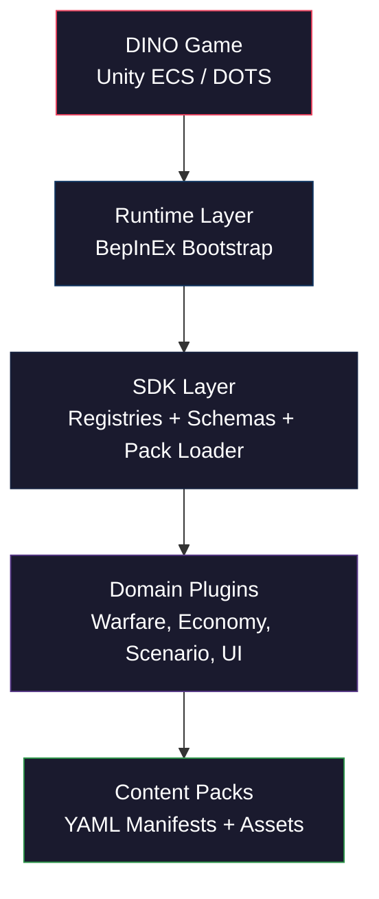
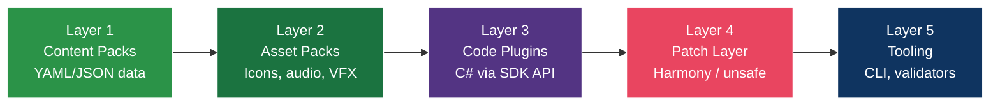

# Architecture

DINOForge is structured as a three-product architecture with clear layering boundaries.

## System Overview



## Three Products

### Product A — Runtime / Hook Layer

The lowest level. Most brittle, fewest agents should touch.

- Boots into DINO via BepInEx + modified Doorstop pre-loader
- Locates ECS systems, entities, components, assets
- Exposes safe patch points
- Handles version checks and rollback/fallback
- Provides debug surfaces (entity dumper, system enumerator, debug overlay)

**Output**: `BepInEx/ecs_plugins/DINOForge.Runtime.dll`

### Product B — Mod API / Domain SDK

The real scaffold. Where trivial modding becomes possible.

- High-level mod definition interfaces
- Hides engine internals behind stable abstractions
- Provides schemas, registries, validators, pack loaders
- Supports multiple mod classes (content, balance, ruleset, total conversion, utility)

**Key components**: Pack manifest model, YAML loader (YamlDotNet), dependency resolver, schema validation (JsonSchema.Net)

### Product C — Mod Packs / Content Packs

Where actual mods live. Mostly declarative and content-driven.

- Warfare packs (Modern, Star Wars)
- Balance packs, economy packs
- QoL/UI packs, debug packs
- Each pack has explicit metadata: id, version, dependencies, conflicts

## Content Layering Model

DINOForge applies a 5-layer content model:



| Layer | Description | Frequency |
|-------|-------------|-----------|
| Content Packs | YAML/JSON data — factions, units, stats, waves, localization | Most mods |
| Asset Packs | Bundled art/audio/prefab with manifests | Visual/audio mods |
| Code Plugins | C# plugin API through SDK interfaces | Advanced mods |
| Patch Layer | Controlled Harmony patches (marked unsafe) | Rare |
| Tooling | CLI tools, validators, inspectors | Development |

## Design Principles

1. **Wrap, don't handroll** — Use established libraries, wrap them thinly
2. **Framework before content** — Platform first, themed mods second
3. **Declarative before imperative** — YAML manifests over C# patches
4. **Stable abstraction over unstable internals** — Isolate ECS glue
5. **Agent-first repo design** — Optimize for autonomous agent development
6. **Observability is first-class** — Logs, overlays, reports, validators
7. **Domain extensibility** — Warfare is first plugin, not the only one
8. **Compatibility-aware packaging** — Explicit deps, conflicts, versions
9. **Graceful degradation** — Fail loudly with fallbacks

## Repository Layout

```
DINOForge/
  src/
    Runtime/             # Product A — BepInEx plugin
      Bridge/            #   ECS bridge (component mapping, stat modifiers, queries)
      HotReload/         #   Hot reload bridge
      UI/                #   Mod menu overlay (F10), settings panel
    SDK/                 # Product B — Public mod API
      Assets/            #   Asset service, addressables catalog
      Dependencies/      #   Dependency resolver
      HotReload/         #   Pack file watcher
      Models/            #   Content data models
      Registry/          #   Generic registry with conflict detection
      Universe/          #   Universe Bible system
      Validation/        #   Schema validation (NJsonSchema)
    Bridge/
      Protocol/          #   JSON-RPC types, IGameBridge interface
      Client/            #   Out-of-process game client
    Domains/
      Warfare/           #   Warfare domain (factions, doctrines, combat)
      Economy/           #   Economy domain (rates, trade, balance)
      Scenario/          #   Scenario domain (scripting, conditions)
      UI/                #   UI domain (HUD injection, menus)
    Tools/
      Cli/               #   dinoforge CLI (11 commands)
      McpServer/         #   MCP server for Claude Code (13 tools)
      PackCompiler/      #   Pack compiler (validate, build)
      DumpTools/         #   Dump analysis (Spectre.Console)
      Installer/         #   BepInEx + DINOForge installer
    Tests/               #   Unit tests (xUnit + FluentAssertions)
      Integration/       #   Integration tests
  packs/                 # Product C — Content packs (6 example packs)
  schemas/               # Canonical schema definitions (17 schemas)
  docs/                  # This documentation site
  manifests/             # Ownership map, extension points
```

## Reference Models

DINOForge draws from the best modding ecosystems:

| System | What We Take |
|--------|-------------|
| Factorio | API shape, manifests, dependency/version handling |
| RimWorld | Declarative content + imperative code escape hatch |
| Satisfactory/BepInEx | Mod loaders, plugin bootstrap |
| Minecraft Bedrock | Pack schemas, folder conventions |
| UEFN/Roblox | End-to-end creation pipeline concept |
