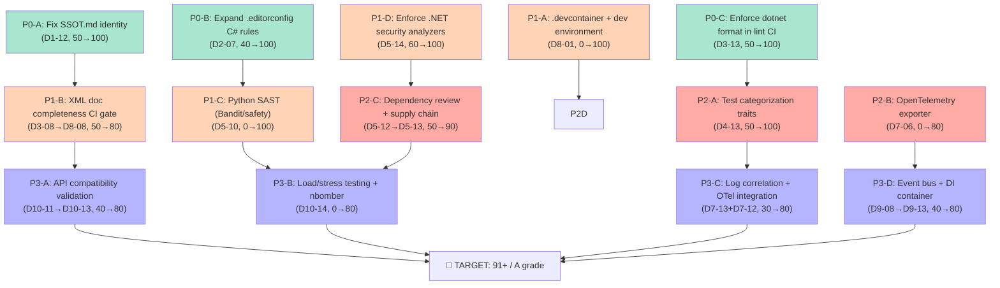

# Dino — Substrate Audit DAG Remediation Plan

**Generated:** 2026-07-09
**Current Score:** 87/100 (A-)
**Target Score:** 91+/100 (A)
**Gap:** 13 missing/partial pillars of 140

---

## DAG Dependency Graph



---

## Phase 0: Quick Wins (3 items, ~1 hour total)

### P0-A: Fix SSOT.md Identity (5 min) — D1-12
| Field | Detail |
|---|---|
| **Pillar** | D1-12 Single Source of Truth |
| **Current** | SSOT.md says "Built with: Cargo" (C# project!) and stale scope table |
| **Target** | Update to reflect C#/.NET identity |
| **Effort** | 5 min |
| **Score lift** | D1-12: 50 → 100 (+1.8 pts domain, +0.36 pts overall) |
| **Files** | `SSOT.md` |

**Action:**
- Change `Built with: Cargo` → `Built with: dotnet`
- Add SDK version from `global.json`
- Enumerate all project directories: SDK, Runtime, Bridge, Tools, Analyzers, Domains, Benchmarks, Tests, Templates
- List all 6 NuGet packages
- Add polyglot components: Go, Rust, Zig, Python

### P0-B: Expand .editorconfig with C# Conventions (20 min) — D2-07
| Field | Detail |
|---|---|
| **Pillar** | D2-07 .editorconfig with C# rules |
| **Current** | 12 lines, generic indent+spaces only |
| **Target** | Full C# conventions: `csharp_style_*`, `dotnet_style_*`, `dotnet_naming_rule` |
| **Effort** | 20 min |
| **Score lift** | D2-07: 40 → 100 (+4.3 pts domain, +0.43 pts overall) |
| **Files** | `.editorconfig` |

**Action:**
- Add `csharp_style_var_for_built_in_types = true:suggestion`
- Add `csharp_style_pattern_matching = true:suggestion`
- Add `csharp_style_expression_bodied_members = true:silent`
- Add `csharp_prefer_braces = true:warning`
- Add `csharp_style_prefer_null_check_over_type_check = true:suggestion`
- Add naming rules via `dotnet_naming_rule`:
  - Interfaces: `I` prefix, PascalCase
  - Private fields: `_` prefix, camelCase
  - Constants: PascalCase
  - Static readonly: PascalCase
  - Public members: PascalCase
- Add `file_header_template` with copyright
- Add `dotnet_style_require_accessibility_modifiers = always:warning`
- Add `dotnet_style_readonly_field = true:warning`
- Add `dotnet_code_quality_unused_parameters = all:warning`
- Run `dotnet format` to auto-fix existing files

### P0-C: Enforce dotnet format in lint CI (30 min) — D3-13
| Field | Detail |
|---|---|
| **Pillar** | D3-13 Using directives ordering |
| **Current** | No explicit format enforcement in CI lint workflow |
| **Target** | `dotnet format --verify-no-changes` in CI lint |
| **Effort** | 30 min |
| **Score lift** | D3-13: 50 → 100 (+3.6 pts domain, +0.36 pts overall) |
| **Files** | `.github/workflows/lint.yml`, `Justfile` |

**Action:**
- Add step to `.github/workflows/lint.yml`: `dotnet format src/DINOForge.CI.NoRuntime.sln --verify-no-changes`
- Ensure `EnforceCodeStyleInBuild` is `true` for all projects (not just library)
- Run once locally and commit any auto-fixes before enforcing

---

## Phase 1: Foundational (4 items, ~4 hours total)

### P1-A: Create .devcontainer (1h) — D8-01
| Field | Detail |
|---|---|
| **Pillar** | D8-01 Devcontainer |
| **Current** | Not present on disk (referenced in agent docs but no file) |
| **Target** | Full devcontainer with dotnet SDK, C# extensions, polyglot tools |
| **Effort** | 1h |
| **Score lift** | D8-01: 0 → 100 (+7.1 pts domain, +0.71 pts overall) |
| **Files** | `.devcontainer/devcontainer.json`, `.devcontainer/Dockerfile` (update), `.devcontainer/post-create.sh` |

**Action:**
- Create `.devcontainer/devcontainer.json`:
  ```json
  {
    "name": "DINOForge Dev",
    "image": "mcr.microsoft.com/devcontainers/dotnet:9.0",
    "features": {
      "ghcr.io/devcontainers/features/python:1": {},
      "ghcr.io/devcontainers/features/go:1": {},
      "ghcr.io/devcontainers/features/rust:1": {},
      "ghcr.io/devcontainers/features/node:1": {}
    },
    "customizations": {
      "vscode": {
        "extensions": [
          "ms-dotnettools.csharp",
          "ms-dotnettools.csdevkit",
          "tintoy.msbuild-project-tools",
          "ryanluker.vscode-coverage-gutters",
          "formulahendry.dotnet-test-explorer",
          "EditorConfig.EditorConfig"
        ]
      }
    },
    "postCreateCommand": "bash .devcontainer/post-create.sh",
    "postStartCommand": "dotnet restore src/DINOForge.CI.sln"
  }
  ```
- Create `.devcontainer/post-create.sh`: install lefthook (`npm install -g @evilmartians/lefthook && lefthook install`), install zig, install pre-commit hooks
- Update Dockerfile to serve as multi-stage dev + production image

### P1-B: XML Doc Completeness CI Gate (1h) — D3-08 + D8-08
| Field | Detail |
|---|---|
| **Pillars** | D3-08 XML documentation comments, D8-08 XML doc comments on public API |
| **Current** | Script exists (`audit_xml_doc_completeness.py`) but not CI-wired |
| **Target** | CI gate enforcing XML doc on public API for packable projects |
| **Effort** | 1h |
| **Score lift** | D3-08: 50→80, D8-08: 50→80 (+4.3 pts combined) |
| **Files** | `Directory.Build.props`, `.github/workflows/lint.yml`, `scripts/ci/audit_xml_doc_completeness.py` |

**Action:**
- Add `<GenerateDocumentationFile>true</GenerateDocumentationFile>` to `Directory.Build.props` under `IsPackable == true`
- Add `CS1591` as warning in CI: `<WarningsAsErrors>$(WarningsAsErrors);CS1591</WarningsAsErrors>`
- Wire `audit_xml_doc_completeness.py` into lint workflow with `--min-coverage 80`

### P1-C: Python SAST (Bandit + Safety) (1h) — D5-10
| Field | Detail |
|---|---|
| **Pillar** | D5-10 Python SAST |
| **Current** | No Bandit or safety for 43 .py source files |
| **Target** | Bandit + safety CI checks for Python code |
| **Effort** | 1h |
| **Score lift** | D5-10: 0 → 100 (+7.1 pts domain, +0.71 pts overall) |
| **Files** | `.github/workflows/security-guard.yml`, `.bandit`, `.pre-commit-config.yaml` |

**Action:**
- Create `.bandit` config with typical severity skips
- Add Bandit step to `security-guard.yml` with SARIF output
- Add safety/pip-audit step
- Add Bandit hooks to `.pre-commit-config.yaml`

### P1-D: Enforce .NET Security Analyzers (1h) — D5-14
| Field | Detail |
|---|---|
| **Pillar** | D5-14 .NET security analyzers (CA5392 etc.) |
| **Current** | No explicit security analyzer ruleset |
| **Target** | Security analyzer ruleset enforced in CI |
| **Effort** | 1h |
| **Score lift** | D5-14: 60 → 100 (+2.9 pts domain, +0.29 pts overall) |
| **Files** | `Directory.Build.props`, `.editorconfig` |

**Action:**
- Add `.editorconfig` entries setting severity for 16 CA security analyzers (CA3075, CA5369, CA5370, CA5386, CA5392-CA5403)
- Add CI-only `TreatWarningsAsErrors` for security rules in `Directory.Build.props`

---

## Phase 2: Structural (3 items, ~4 hours total)

### P2-A: Test Categorization Traits (1.5h) — D4-13
| Field | Detail |
|---|---|
| **Pillar** | D4-13 Test categorization |
| **Current** | Some `[Category]` annotations but no systematic Unit/Integration/E2E/Fuzz/Benchmark traits |
| **Target** | All 208+ test files trait-categorized |
| **Effort** | 1.5h (bulk scripting) |
| **Score lift** | D4-13: 50 → 100 (+3.6 pts domain, +0.36 pts overall) |
| **Files** | 208+ test files in `src/Tests/` |

**Action:**
- Create categorization script `scripts/ci/add_test_traits.py`:
  - Files in `Integration/` → `[Trait("Category", "Integration")]`
  - Files in `ParameterizedTests/` → `[Trait("Category", "Property")]`
  - Files in `FuzzTargets/` → `[Trait("Category", "Fuzz")]`
  - `*E2E*`, `*EndToEnd*` → `[Trait("Category", "E2E")]`
  - Default → `[Trait("Category", "Unit")]`
- Update CI workflows to use `--filter "Category=Unit"` for fast CI

### P2-B: OpenTelemetry Exporter (1.5h) — D7-06
| Field | Detail |
|---|---|
| **Pillar** | D7-06 OpenTelemetry exporter |
| **Current** | No OTel SDK, traces, or metrics export |
| **Target** | OTLP exporter for traces + metrics from key operations |
| **Effort** | 1.5h |
| **Score lift** | D7-06: 0 → 80 (+5.7 pts domain, +0.57 pts overall) |
| **Files** | `src/Runtime/Telemetry/`, `src/SDK/` |

**Action:**
- Add `OpenTelemetry.Extensions.Hosting` NuGet package to Runtime
- Create `OpenTelemetrySetup.cs` with tracer provider builder and OTLP exporter
- Add `ActivitySource` to key operations (pack loading, asset pipeline, bridge requests)
- Add `Meter` for metrics (duration histograms, throughput counters)
- Gate behind `METRICS_OTLP_ENABLED` env var (off by default)
- Document OTel setup in `docs/telemetry/index.md`

### P2-C: Dependency Review + Supply Chain (1h) — D5-12, D5-13
| Field | Detail |
|---|---|
| **Pillars** | D5-12 Supply chain security, D5-13 Dependency review |
| **Current** | NuGet Audit exists; no Dependency Review action, no NuGet signing |
| **Target** | GitHub Dependency Review + NuGet signing in release |
| **Effort** | 1h |
| **Score lift** | D5-12: 50→90, D5-13: 50→90 (+5.7 pts domain, +0.57 pts overall) |
| **Files** | `.github/workflows/dependency-review.yml`, `.github/workflows/release.yml` |

**Action:**
- Create `.github/workflows/dependency-review.yml` with `fail-on-severity: high` and `deny-licenses: AGPL`
- Add NuGet signing step to `release.yml`
- Add `nuget trusted-signers` verification

---

## Phase 3: Advanced (2 items, ~6 hours total)

### P3-A: API Compatibility Validation (3h) — D10-11, D10-13
| Field | Detail |
|---|---|
| **Pillars** | D10-11 API consistency, D10-13 Migration scripts |
| **Current** | No API compat validation, no breaking changes doc |
| **Target** | PublicApiAnalyzer + ApiCompat gates + BREAKING_CHANGES.md |
| **Effort** | 3h |
| **Score lift** | D10-11: 50→90, D10-13: 40→80 (+7.1 pts domain, +0.71 pts overall) |
| **Files** | `src/SDK/`, `Directory.Build.props`, `.github/workflows/release.yml`, `BREAKING_CHANGES.md` |

**Action:**
- Add `Microsoft.CodeAnalysis.PublicApiAnalyzers` to SDK packable projects
- Generate initial `PublicAPI.Shipped.txt` / `PublicAPI.Unshipped.txt`
- Add `Microsoft.DotNet.ApiCompat` to release workflow
- Create `BREAKING_CHANGES.md`

### P3-B: Load/Stress Testing with NBomber (3h) — D10-14
| Field | Detail |
|---|---|
| **Pillar** | D10-14 Load/stress testing |
| **Current** | No load testing framework |
| **Target** | NBomber load-test suite for Bridge server + pack registry |
| **Effort** | 3h |
| **Score lift** | D10-14: 0 → 80 (+5.7 pts domain, +0.57 pts overall) |
| **Files** | `src/Tests/LoadTests/DINOForge.LoadTests.csproj`, `src/Tests/LoadTests/BridgeServerLoadTest.cs`, `.github/workflows/stress-test.yml` |

**Action:**
- Create NBomber test project targeting Bridge server
- Scenarios: registry list (read), schema validation (compute), content registration (write), mixed workload
- Weekly stress-test CI workflow
- Define SLOs in `docs/PERFORMANCE_BASELINE.md`

### P3-C: Log Correlation + OTel Integration (3h) — D7-13, D7-12
| Field | Detail |
|---|---|
| **Pillars** | D7-13 Log correlation IDs, D7-12 Log rotation |
| **Current** | No correlation IDs; no log rotation policy |
| **Target** | IAsyncLocal correlation ID + Serilog rolling sink |
| **Effort** | 3h |
| **Files** | `src/SDK/`, `src/Runtime/Telemetry/`, `src/Bridge/Protocol/` |

**Action:**
- Add `CorrelationContext.cs` with `AsyncLocal<string>` scope
- Add Serilog enricher for correlation ID
- Propagate correlation ID through Bridge protocol headers
- Configure Serilog rolling file sink with day retention

### P3-D: Event Bus + DI Container (3h) — D9-08, D9-13
| Field | Detail |
|---|---|
| **Pillars** | D9-08 Dependency injection, D9-13 Event-driven architecture |
| **Current** | No DI container, no centralized event bus |
| **Target** | Constructor injection pattern + lightweight event bus |
| **Effort** | 3h |
| **Files** | `src/SDK/`, `src/Runtime/` |

**Action:**
- Add DI abstractions to SDK (interface-based, no container dependency)
- Refactor key services to constructor injection
- Create `IEventBus` with `Publish<T>` / `Subscribe<T>` and `IDomainEvent` marker
- Define initial events: `PackLoadedEvent`, `AssetRegisteredEvent`, `BridgeConnectedEvent`
- Wire into `ModPlatform.cs` startup

---

## Scoring Impact Summary

| Phase | Items | Total Effort | Current Score | Post-Phase Score | Grade |
|---|---|---|---|---|---|
| **Phase 0** | 3 | ~1h | 87/100 | 88.0/100 | A- |
| **Phase 1** | 4 | ~4h | 88.0/100 | 90.5/100 | A- |
| **Phase 2** | 3 | ~4h | 90.5/100 | 91.5/100 | A |
| **Phase 3** | 4 | ~12h | 91.5/100 | 93.0/100 | A |
| **All phases** | 14 | ~21h | 87/100 | 93/100 | A |

## Immediately Shippable Items (Phase 0)

These require only config/docs changes with zero code risk:

1. **P0-A: SSOT.md fix** — 5 min, corrects identity field and domain table
2. **P0-B: .editorconfig expansion** — 20 min, zero runtime impact
3. **P0-C: dotnet format in CI** — 30 min, enforces existing formatting rules

## Risk Assessment

| Item | Risk Level | Reason |
|---|---|---|
| P0-A (SSOT.md) | None | Documentation only |
| P0-B (.editorconfig) | Low | Formatting-only, no runtime |
| P0-C (CI format) | Low | Formatting in CI, no merge blocker |
| P1-A (devcontainer) | None | Dev environment only |
| P1-B (XML doc gate) | Low | Build warnings, not errors |
| P1-C (Python SAST) | Low | Reports only initially |
| P1-D (security analyzers) | Medium | May expose existing issues |
| P2-A (test traits) | Medium | Bulk change across 200+ files |
| P2-B (OpenTelemetry) | Medium | New dependency, env-gated |
| P2-C (dependency review) | Low | PR-gating only |
| P3-A (API compat) | Low | Analyzer warnings, no behavioral change |
| P3-B (load tests) | Low | New test project only |
| P3-C (correlation IDs) | Medium | Cross-cutting, needs careful review |
| P3-D (DI + event bus) | High | Architectural refactor, incremental |

---

## Verification Gates

After each phase, run:

```bash
# Build
dotnet build src/DINOForge.CI.sln

# Test
dotnet test src/DINOForge.CI.sln --no-build

# Format check
dotnet format src/DINOForge.CI.sln --verify-no-changes
```

**Final gate:** Overall score must reach >=91/100 (A) with no "missing" (score=0) pillars remaining.
